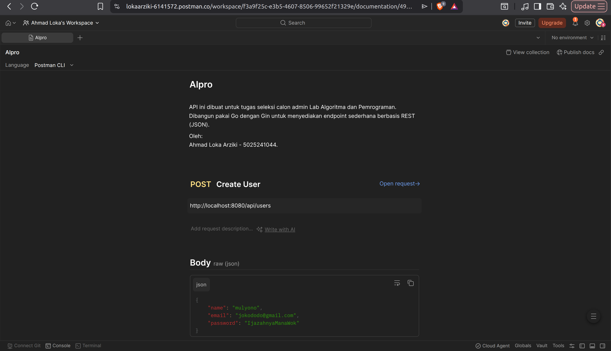

# Dokumentasi Tugas Materi Backend ALPRO

**Nama:** Ahmad Loka Arziki

**NRP:** 5025241044

---


### Boilerplate

Boilerplate singkat kata adalah template yang sering dipakai berulang-ulang dan biasanya sedikit / tidak ada variasi, yang bertujuan untuk memberikan struktur ke project kamu.  

Terdapat beberapa boilerplate backend Go yang tersedia, tetapi di workshop ini kita akan menggunakan [boilerplate ini](https://github.com/Caknoooo/go-gin-clean-starter/tree/main).

Berikut adalah struktur folder boilerplate yang kita gunakan, beserta penjelasan tanggung jawab masing-masing:

```
.
|-- cmd/
|   +-- main.go                        # Entry point -- hanya panggil providers & jalankan server
|
|-- config/
|   |-- database.go                    # Setup koneksi GORM ke PostgreSQL
|   |-- email.go                       # Konfigurasi SMTP untuk kirim email
|   |-- logger.go                      # Setup query logger ke file
|   +-- logs/query_log                 # Output log query SQL
|
|-- database/
|   |-- entities/                      # Definisi struct yang di-mapping ke tabel DB
|   |   |-- common.go                  # Base struct (ID, CreatedAt, UpdatedAt, dll)
|   |   |-- user_entity.go             # Tabel `users`
|   |   +-- refresh_token_entity.go    # Tabel `refresh_tokens`
|   |-- migrations/                    # Versi skema database (seperti git untuk DB)
|   |   |-- 20240101000000_create_users_table.go
|   |   +-- 20240101000001_create_refresh_tokens_table.go
|   |-- seeders/                       # Data awal untuk development/testing
|   |   |-- json/users.json            # Data seed dalam format JSON
|   |   +-- seeds/user_seed.go         # Logic untuk insert seed data
|   |-- manager.go                     # Orchestrator: jalankan migrate & seed
|   |-- migration.go                   # Runner untuk file-file migration
|   +-- seeder.go                      # Runner untuk file-file seeder
|
|-- middlewares/
|   |-- authentication.go              # Validasi JWT token di setiap protected route
|   +-- cors.go                        # Izinkan/blokir request lintas domain
|
|-- modules/                           # <-- FOKUS UTAMA workshop
|   |-- auth/                          # Semua yang berkaitan dengan login/logout/token
|   |   |-- controller/auth_controller.go
|   |   |-- dto/auth_dto.go
|   |   |-- repository/refresh_token_repository.go
|   |   |-- service/auth_service.go
|   |   |-- service/jwt_service.go
|   |   |-- validation/auth_validation.go
|   |   |-- tests/auth_validation_test.go
|   |   +-- routes.go
|   +-- user/                          # Semua yang berkaitan dengan data user
|       |-- controller/user_controller.go
|       |-- dto/user_dto.go
|       |-- query/user_query.go
|       |-- repository/user_repository.go
|       |-- service/user_service.go
|       |-- validation/user_validation.go
|       |-- tests/user_validation_test.go
|       +-- routes.go
|
|-- pkg/
|   |-- constants/common.go            # Konstanta global (pesan error, status, dll)
|   |-- helpers/password.go            # Helper bcrypt: hash & compare password
|   +-- utils/
|       |-- aes.go                     # Enkripsi/dekripsi data sensitif
|       |-- email.go                   # Fungsi kirim email via SMTP
|       |-- file.go                    # Helper upload & manajemen file
|       +-- response.go                # Standarisasi format JSON response
|
|-- providers/
|   +-- core.go                        # Dependency injection: wiring semua layer
|
|-- script/
|   |-- command.go                     # Definisi command CLI (migrate, seed, dll)
|   +-- script.go                      # Runner untuk perintah dari terminal
|
|-- docker/
|   |-- Dockerfile                     # Build image untuk production
|   |-- nginx/default.conf             # Konfigurasi reverse proxy
|   +-- postgresql/                    # Konfigurasi PostgreSQL container
|
|-- docker-compose.yml                 # Jalankan seluruh stack (App + DB + Nginx)
|-- go.mod
+-- go.sum
```

#### Alur Request -- Dari HTTP ke Database

Setiap request yang masuk melewati lapisan-lapisan ini secara berurutan:

```
HTTP Request
    |
    v
[Middleware]           -> Auth check (JWT valid?), CORS header
    |
    v
[Controller]           -> Terima request Gin, panggil Validation, kirim response
    |
    v
[Validation]           -> Validasi input (field required, format email, dll)
    |
    v
[Service]              -> Business logic (hash password, generate token, dll)
    |
    v
[Repository]           -> Query ke database via GORM
    |
    v
[Database / Entity]    -> PostgreSQL
```

#### Pola Per-Module

Setiap fitur baru dibuat dalam satu folder `modules/<nama_fitur>/` yang memiliki struktur seragam:

| File | Tanggung Jawab |
|---|---|
| `controller/` | Terima `*gin.Context`, parsing input, kirim JSON response |
| `dto/` | Struct untuk request body & response (Data Transfer Object) |
| `validation/` | Aturan validasi input sebelum masuk ke service |
| `service/` | Business logic -- tidak boleh tahu soal HTTP atau database secara langsung |
| `repository/` | Semua query GORM -- satu-satunya layer yang boleh sentuh DB |
| `routes.go` | Daftarkan semua endpoint milik module ini |

> [!TIP]
> **Pola ini membuat kode mudah ditemukan.** Kalau ada bug di response format, cari di `controller`. Kalau ada bug di kalkulasi bisnis, cari di `service`. Kalau ada bug di query lambat, cari di `repository`.

#### Cara Jalankan Project

```bash
# Clone dan install dependency
go mod tidy
# `go mod tidy` mendownload semua dependency yang tercatat di go.mod
# dan menghapus dependency yang tidak dipakai.

# Jalankan seluruh stack dengan Docker
docker-compose up -d

# Jalankan development server
go run cmd/main.go
```

---

### Challenge A -- `GET /users/:id`

> Ambil satu user berdasarkan ID. Kembalikan `404` jika tidak ditemukan.

Dalam challenge ini, saya membagi prosesnya ke dalam 4 tahapan sesuai struktur folder boilerplate:

**1. Layer Routes (`routes.go`)** Pertama, daftarkan endpoint baru dengan parameter dinamis `:id`. Karena data user bersifat sensitif, kita pasang middleware `Authentication`.
```go
func RegisterUserRoutes(r *gin.RouterGroup, ctrl *controller.UserController, jwtSvc *authService.JWTService) {
    users := r.Group("/users")
    {
        // Parameter :id digunakan untuk menangkap ID dari URL
        users.GET("/:id", middlewares.Authentication(jwtSvc), ctrl.GetUserByID) 
    }
}
```

**2. Layer Controller (`user_controller.go`)** Di sini kita ambil `id` dari URL. Karena `c.Param` hasilnya string, kita perlu convert ke integer pakai `strconv.Atoi` agar sesuai dengan kebutuhan service.
```go
func (ctrl *UserController) GetUserByID(c *gin.Context) {
    // Ambil ID dari URL dan konversi ke Integer
    userID, _ := strconv.Atoi(c.Param("id"))

    user, err := ctrl.service.Get(userID)
    if err != nil {
        // Jika service return error (data tidak ada), kirim response 404
        utils.ErrorResponse(c, http.StatusNotFound, "User tidak ditemukan")
        return
    }

    utils.SuccessResponse(c, http.StatusOK, "Berhasil mendapatkan profil user", user)
}
```

**3. Layer Service (`user_service.go`)** Layer ini bertugas sebagai jembatan. Kita tidak langsung mengembalikan `entities.User` ke client karena entity biasanya mengandung field sensitif (seperti password). Kita map datanya ke `dto.UserResponse`.
```go
func (s *UserService) Get(id int) (*dto.UserResponse, error) {
    user, err := s.repo.FindByID(id)
    if err != nil {
        return nil, err
    }

    // Mapping manual dari Entity ke DTO (Data Transfer Object)
    return &dto.UserResponse{
        ID:    user.ID,
        Name:  user.Name,
        Email: user.Email,
        Role:  user.Role,
    }, nil
}
```

**4. Layer Repository (`user_repository.go`)** Layer terakhir yang berinteraksi langsung dengan database. Kita gunakan `.Select()` untuk memastikan GORM hanya mengambil kolom yang kita butuhkan saja (efisiensi query).
```go
func (r *UserRepository) FindByID(id int) (*entities.User, error) {
    var user entities.User
    // First akan mengambil 1 data pertama yang cocok, jika tidak ada akan return error
    err := r.db.Select("id", "name", "email", "role").Where("id = ?", id).First(&user).Error
    return &user, err
}
```

### Challenge B -- `GET /users`

> Ambil semua user. Kembalikan array JSON.

Mirip dengan Challenge A, tapi kali ini kita berurusan dengan sekumpulan data (slice).

**1. Layer Routes (`routes.go`)** Daftarkan endpoint `GET` pada root group `/users`.
```go
users.GET("", middlewares.Authentication(jwtSvc), ctrl.GetAllUsers) // GET /api/users
```

**2. Layer Controller (`user_controller.go`)** Tugas controller di sini sangat simpel: panggil fungsi service dan kirimkan hasilnya.
```go
func (ctrl *UserController) GetAllUsers(c *gin.Context) {
    users, err := ctrl.service.GetAll()
    if err != nil {
        utils.ErrorResponse(c, http.StatusInternalServerError, "Gagal mengambil daftar users")
        return
    }
    utils.SuccessResponse(c, http.StatusOK, "Daftar user berhasil dimuat", users)
}
```

**3. Layer Service (`user_service.go`)** Karena repository mengembalikan `[]entities.User`, kita harus melakukan *looping* untuk mengubah setiap item menjadi `dto.UserResponse` sebelum dimasukkan ke dalam slice responses.
```go
func (s *UserService) GetAll() ([]dto.UserResponse, error) {
    users, err := s.repo.FindAll()
    if err != nil {
        return nil, err
    }

    var responses []dto.UserResponse
    for _, user := range users {
        // Bungkus data entity ke dalam bentuk DTO
        userRes := dto.UserResponse{
            ID:    user.ID,
            Name:  user.Name,
            Email: user.Email,
            Role:  user.Role,
        }
        responses = append(responses, userRes)
    }
    return responses, nil
}
```

**4. Layer Repository (`user_repository.go`)** Kita gunakan method `.Find()` untuk menarik semua baris dari tabel `users`.
```go
func (r *UserRepository) FindAll() ([]entities.User, error) {
    var users []entities.User
    // Mengambil semua user tapi terbatas pada kolom id, name, email, dan role saja
    err := r.db.Select("id", "name", "email", "role").Find(&users).Error
    return users, err
}
```

> [!WARNING]
> **Tips debugging:** Error paling umum di Go adalah lupa menangani `if err != nil`. Kalau ada `panic`, cari baris yang tidak menangani error return-nya. Gunakan `fmt.Println(err)` untuk print error ke terminal.

---

[**Dokumentasi API via Postman** ](https://lokaarziki-6141572.postman.co/workspace/Ahmad-Loka's-Workspace~f3a9f25c-e3b5-4607-8506-99652f21329e/collection/49475902-5495c0ff-4abf-42e4-90d2-70a0e1a3ee63?action=share&creator=49475902)


[klik link di sini](https://lokaarziki-6141572.postman.co/workspace/Ahmad-Loka's-Workspace~f3a9f25c-e3b5-4607-8506-99652f21329e/collection/49475902-5495c0ff-4abf-42e4-90d2-70a0e1a3ee63?action=share&creator=49475902)

<div align="center">

*Tutorial ini adalah awal, bukan akhir. Yang paling penting adalah terus membangun sesuatu.*

**Selamat ngoding!**

</div>
# be-alpro
# materi-be-alpro
# materi-be-alpro
